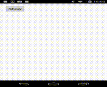

This is a live sample of the answer in this stackoverflow post, [How to handle Handler messages when activity/fragment is paused](http://stackoverflow.com/questions/8040280/how-to-handle-handler-messages-when-activity-fragment-is-paused)

